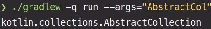
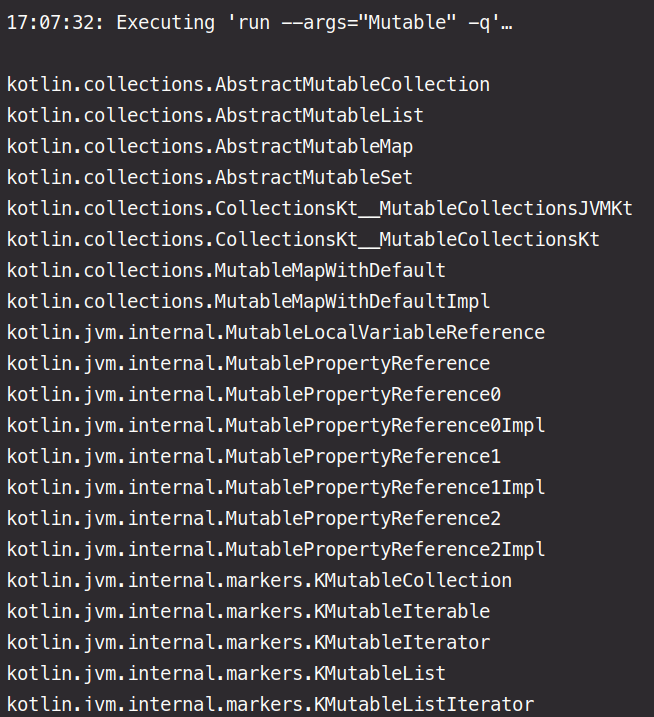
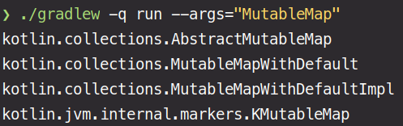

## My implementation of the task

## To Compile/Run

### Method 1
Use IntelliJ to just run the file in which you can set the 
command line arguments through editing configurations.
This is probably the easiest way to do this.

### Method 2 
```bash
./gradlew build 
./gradlew -q run --args="Array"
./gradlew -q run --args="AbstractCol"
./gradlew -q run --args="List"
./gradlew -q run --args="Mutable"
```



